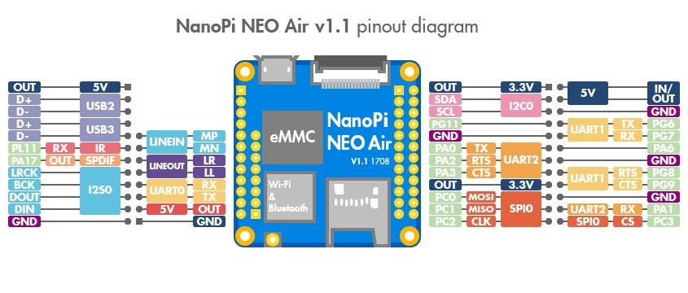

# nixi-clock-3

Nixi clock Rev 3 code, and scripts

Main code is in C: [src](src)

With test scripts being in Bash: [bash](bash)

## Chips

### MCP23017 (0x20)
http://www.farnell.com/datasheets/12179.pdf

A0 = over volte detection
A1 = mute
A2 = SHDN
A3 = relay
A4 = HV enable
A5 = over current detection
A6 = OE (global output enable)

 ### PCA9685 (40, 50, 60, 70, 48, 68) 
https://www.nxp.com/docs/en/data-sheet/PCA9685.pdf
basicaly every 4th register is the brightness value.

 ### ATiny85 (69, 45, 42, 2a, 62, b4)
nixi-clock-neon.ino

 ### ADC121C021 (5a, 55)
http://www.ti.com/lit/ds/symlink/adc121c021.pdf

## NanoPi NEO Air v1.1

The Nixi Clock can be controlled by a [NanoPi NEO Air v1.1](http://wiki.friendlyarm.com/wiki/index.php/NanoPi_NEO_Air)

### Rotary Encoder

JWolf is using a Rotary Encoder which is connected to the NanoPi powered by 3.3v. 

| Device | Pinout name | Pin name | BCM (C#) | Physical pin | 
| :-------------: | :-------------: | :-------------: | :-------------: | :-------------: |
| Button | xxx | xxx | xxx | 8 | 
| Rotation1 | xxx | xxx | xxx | 10 | 
| Rotation2 | xxx | xxx | xxx | 12 | 

